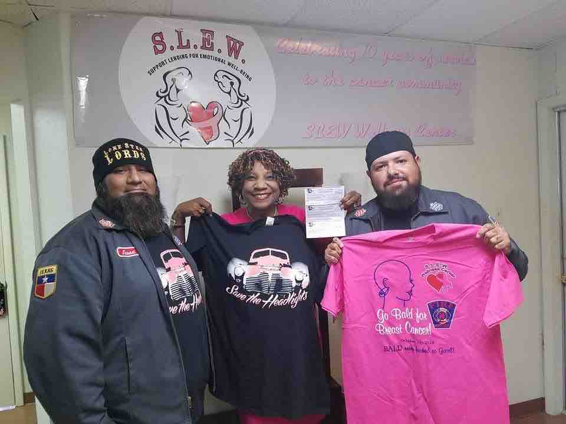

## Benefit for Breast Cancer Awareness Month

For the month of October our club sells limited T-Shirt prints in support of National Breast Cancer Awareness Month to benefit a local clinic in San Antonio, TX.  Our club designs a new *"Save The Headlights'* Support Club t-shirt every year to sell in September and October to raise funds in order to donate to **S.L.E.W. Cancer Wellness Center** in San Antonio, TX.  

## S.L.E.W. Cancer Wellness Center

Our club chose to team up and donate all our proceeds from the sale of our t-shirts to the **S.L.E.W. Cancer Wellness Center**, which is a non profit agency for uninsured, and low-income women who are diagnosed with all types of cancer. We chose this organization due to their mission of _"providing free **emotional and physical support** to meet the needs of disadvantaged women by providing a continuum of care that restores the health and dignity of vulnerable women who become isolated and invisible after treatment." 

>- **Each year the club votes on which member's vehicle will be the face for that year's campaign**
>- **Front and Back design for shirt print is voted on and submitted to print shop for a run of 250, distribution date TBD.**
>- **All shirts sold every weekend during the months of September and October by members at car meets, bars, and swap meets.**
>- **Sizes available S,M, L, and XL- Cost $20 (sizes XXL, XXXL-additional $5, must be pre-ordered and paid in advance)**
>- ** Yearly proceeds usually average about $

   
![[D12C515F-4C6F-4FF9-AC44-A47BBC259F25.jpeg]]

![[5C7F09A8-F03C-463F-AA3D-FE171A383A37.jpeg]]