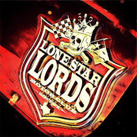

**Every year we host our annual Lone Star Texas Independence Beer Bash to commemorate Texas Independence Day which is on March 2nd. Our annual party is usually held the weekend prior or after the actual date of the holiday. This event is near and dear to our club as well as our sponsor, Lone Star Beer. It's not everyday that a local car club has the sponsorship and support of the National Beer of Texas. This event would not be possible if it wasn't for our sponsor and the love of our Lone Star State.** 

### Biggest Fundraising Event of the year
The Texas Independence Lone Star Beer Bash serves as our biggest fundraising event of the year which helps us fund our club activities, and community events throughout the year which include, [Save the Headlights](Save%20the%20Headlights.md), [Punks For Tots](Punks%20For%20Tots.md), [Trunk or Treat](Trunk%20or%20Treat.md), and [Christmas Tree Run](Christmas%20Tree%20Run.md).  Our proceeds also fund our local Car Show registration/entry fees and vendor fees to sell Support merchandise. 

## **_Event Attractions_**
>- Car Show
>- *Live (music/bands/D.J.'s)*
>- *Texas Theme tattoos-$40*
>- *Vendors- merchandise*
>- *Food trucks*
>- *Burnout Contest - winner gets 2 free tires*
>- *Free beer- courtesy of our sponsor, Lone Star Beer (donations accepted)*
>- *Pinup Contest*
>- *Chili cook-off*

 

