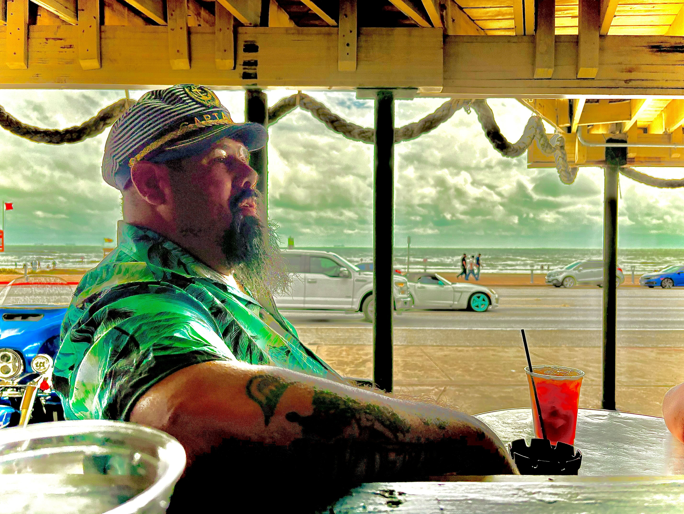
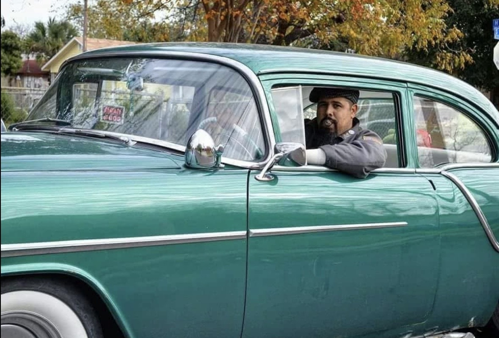

* One of the founding members of the Lone Star Lords Motor Club
* Works as a Master Elevator Technician
* Owns over 6 classic vehicles majority from the year 1954
* Married w/ 3 Daughters and 1 Son- [Zander (Zander)](Zander%20(Zander).md)
* Pets-1 Dog and 1-Potbelly Pig named RoRo
* Dream Car- Varies- "Every car is a dream car! Depends on what day it is..."
* Member for 21 years
* Owns 3 Cars but technically has about 10 project vehicles 
	* 1. 1954 Oldsmobile
	* 2. 1930 Model A
	* 3. 1948 Ford Business Coupe

