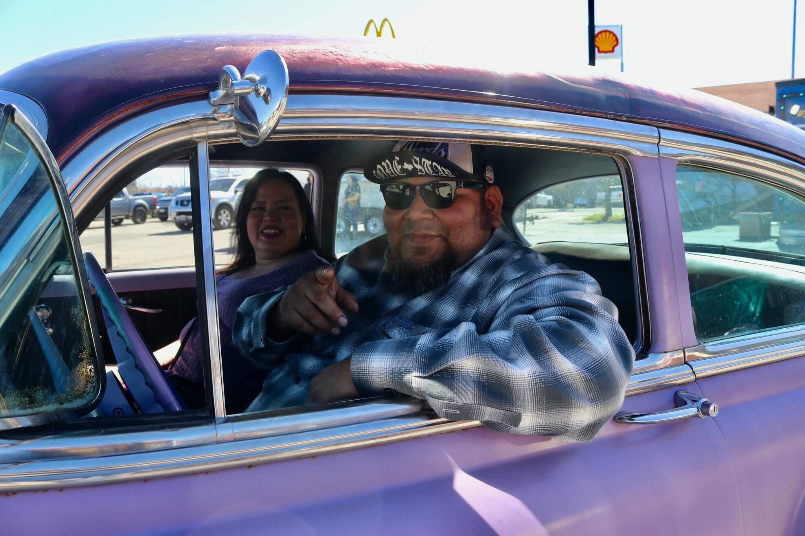

Arnold's fleet of vehicles consist of two cars from the 1950's. You can say he has a taste of the Golden age era or the fabulous Fifties. [Arnold (Big A)](../members/Arnold%20(Big%20A).md) 

* 1954 Chevrolet 210 2 Door (Flat Lavender paint w/ Metallic Black Cherry Plum Rose laced pattern rooftop)
* 1958 Belair 4 Door (Black/Aqua 2 -tone paint)

 