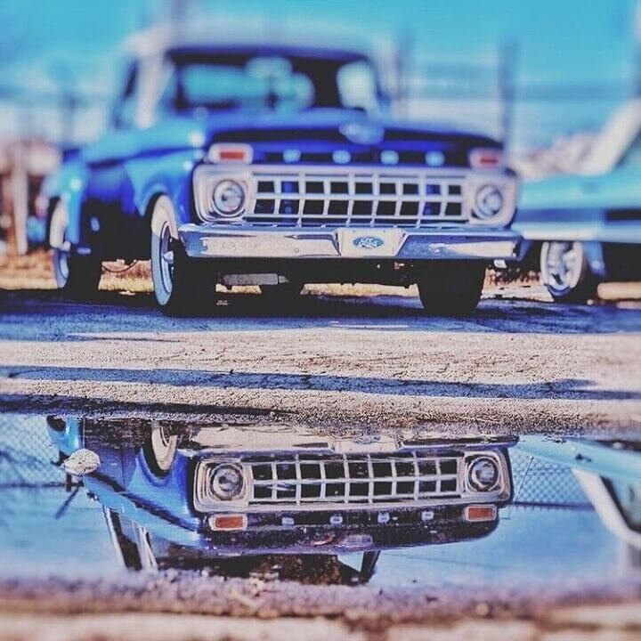

Chang is also another member with the trifecta in his fleet just like [Club Vice President- Jesse (Chuy)](../members/Club%20Vice%20President-%20Jesse%20(Chuy).md). The trifecta includes a 1965 Ford F100 Step-side pickup with flat matte blue paint with pearl whit rooftop, sitting on a 3" static drop wit 3"wide whitewalls. Chang also has a project in progress 1949 Ford Shoebox 2 Door coupe in flat black primer paint.  And lastly is a 2001 Harley Davidson Sportster Bobber with 12"Ape Hangers, Kustom Pagan Green metallic paint, and Avon White wall tires and Spoked rims  [Club Sgt. At Arms- Joe (Chang)](../members/Club%20Sgt.%20At%20Arms-%20Joe%20(Chang).md) 
  

